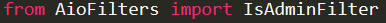

# AioFilters
A python library. This is an admin filter to Aiogram library

## Using


```py
from AioFilters import IsAdmin
```

```py
dp.filters_factory.bind(IsAdminFilter)
```

To use this filter in admin commands you must write:

```py
@dp.message_handler(is_admin=True)
```

[PyPi](https://pypi.org/project/aiofilters/)
